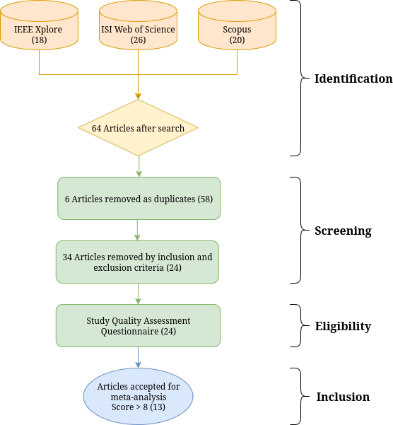

# Systematic Review Protocol

This protocol follows PRISMA guidelines to conduct a systematic review and meta-analysis of AI-based semantic segmentation models for agricultural land-use and land-cover (LULC) mapping.



## 1. Objective

Evaluate the quantitative performance of machine learning and deep learning models applied to semantic segmentation of agricultural LULC. Specifically:

* Synthesize reported performance metrics (F1-score, accuracy, precision, recall, kappa).
* Assess the influence of moderators: model architecture, input data type (satellite, UAV, multispectral, hyperspectral, LiDAR), and validation methods.
* Identify methodological trends, reporting consistency, and main challenges/limitations.

## 2. Research Questions

1. What performance metrics are most frequently reported for AI-based semantic segmentation in agriculture?
2. How do model architecture and input data type affect segmentation performance?
3. Which methodological approaches and validation strategies are most common?
4. What challenges and limitations are reported by primary studies?

## 3. Search Strategy

**Databases:** Scopus, Web of Science, IEEE Xplore

**Publication period:** 2015–present

**Search string:**

```text
(("land use" OR "land cover" OR "agricultural area" OR "environmental zone") AND
 ("semantic segmentation") AND
 ("machine learning" OR "deep learning" OR "artificial intelligence") AND
 ("satellite imagery" OR "UAV imagery" OR "remote sensing" OR "Earth observation") AND
 ("agriculture") AND
 ("accuracy" OR "F1-score" OR "precision" OR "recall" OR "kappa"))
```

## 4. Eligibility Criteria

### Inclusion Criteria

| Criterion | Description                                                                                                                |
| --------- | -------------------------------------------------------------------------------------------------------------------------- |
| IC-1      | Applies semantic segmentation or object-based classification for land-use and land-cover mapping in agricultural contexts. |
| IC-2      | Employs artificial intelligence, machine learning, or deep-learning methods.                                               |
| IC-3      | Reports quantitative performance metrics such as F1-score, accuracy, precision, or recall.                                 |
| IC-4      | Uses geospatial data such as satellite images, UAV imagery, multispectral, hyperspectral, or LiDAR sensors.                |
| IC-5      | Full text available in English, Portuguese, or Spanish.                                                                    |
| IC-6      | Published from 2015 onward.                                                                                                |

### Exclusion Criteria

| Criterion | Description                                                                |
| --------- | -------------------------------------------------------------------------- |
| EC-1      | The study does not focus on agriculture.                                   |
| EC-2      | Review, opinion, editorial, or other source lacking primary data.          |
| EC-3      | Full text is not available.                                                |
| EC-4      | The test or validation sample size is not reported and cannot be inferred. |
| EC-5      | The study language is not English, Portuguese, or Spanish.                 |

## 5. Selection Process

1. **Identification:** Retrieve records using search string across databases.
2. **Screening:** Remove duplicates; screen titles and abstracts against eligibility.
3. **Eligibility:** Retrieve full texts; apply inclusion/exclusion criteria.
4. **Included:** Final set of studies for data extraction and meta-analysis.

A PRISMA flowchart documenting numbers at each stage will be generated.

## 6. Data Extraction

Extract the following for each included study:

* **Study ID:** Author(s), year, country
* **Performance metrics:** F1-score, accuracy, precision, recall, kappa
* **Sample size:** Number of images/regions (test set)
* **Model details:** Architecture, backbone, optimizer, learning rate
* **Data characteristics:** Sensor/source, spatial resolution, modality
* **Validation:** Method (hold-out, cross-validation, external)
* **Other variables:** Task type, pre-processing, augmentation

Data will be organized in `sheets/meta_analysis_v4.xlsx`.

## 7. Risk of Bias and Quality Assessment

Use a 10-item checklist scoring each study (Yes = 1; Partial = 0.5; No = 0) on:

1. Clear description of semantic segmentation task
2. AI or ML method detailed
3. Data source and characteristics defined
4. Model architecture described
5. Validation approach reported
6. Pre-processing steps explained
7. Performance metrics fully reported
8. Sample size reported or inferable
9. Limitations discussed
10. Geographical or dataset scope clear

Studies scoring ≥8/10 proceed to meta-analysis.

## 8. Statistical Analysis

* **Effect size:** F1-score transformed via logit
* **Model:** Three-level random-effects meta-analysis (`metafor::rma.mv`)

  * Level 1: Sampling variance
  * Level 2: Variance within study
  * Level 3: Variance between studies
* **Heterogeneity:** Q-test, I² decomposition
* **Publication bias:** Funnel plot, Egger's test
* **Moderator analyses:** Subgroup (architecture, task, data source) and meta-regression (resolution)
* **Sensitivity:** Leave-one-out analysis

Scripts: `meta/meta.r` (R) and `meta/metanalise.ipynb` (Python).

## 9. Reporting

Results will adhere to PRISMA reporting standards and include:

* Forest and funnel plots
* Heatmaps of study/task distributions
* Tables of subgroup and meta-regression findings
* Discussion of methodological trends and limitations

---

*Protocol finalized: July 2025*

